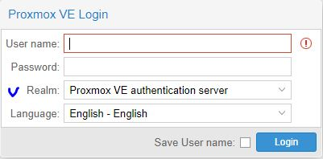

# labs
## Лабораторные работы по МДК 01.02 и МДК 02.01

# Подготовка рабочего места:

##### Для выполнения лабораторных работ необходимо установить и настроить стенд по следующей инструкции:

1. Скачать с яндекс диска готовую виртуальную машину Proxmox с заранее настроеным шаблонами машин в **отдельный каталог**. [образ машины PVE](https://disk.yandex.ru/d/q0ysZKEVqhy2xA)

2. Установить Virtual Box. Скачать можно с [официального сайта](https://www.virtualbox.org/wiki/Downloads).

3. В Virtual Box выбрать добавить машину и указать путь до каталога, где распоалагается скачанная машина **см.п.1**.

## Дома - запустить машину и перейти к пункту 5
## В аудитории: 

4. Сделать клон машины с именем студента

5. Зайти на виртуальную машину и в файле __/etc/network/interfaces__ изменить ip-адрес и адрес шлюза на:
    #### В аудитории использовать IP-адрес:

    |3са1|3са2 |
    |---|------|
    |IP - 192.168.100.1xx|IP -192.168.100.2xx |
    |gateway - 192.168.100.1|gateway - 192.168.100.1|

    где **хх** - номер компьютера  
    #### Дома можно использовать любой свободный адрес.  
6. Перезагрузить сеть командой __systemctl restart networking__

## Загрузка лаборатных работ:

### Для загрузки лабораторных работ используется система доставки git. Инструкция:

1. Зайти на виртуальной машине PVE в каталог /root и выполнить следующие команды:
    1. rm -rf labs
    2. git clone https://github.com/aleti000/labs.git //скачивание лабораторных работ
    3. Зайти в каталог /root/labs/mdk01.02 или /root/labs/mdk01.02 и выполнить скрипт развертывания лабораторной работы 
    
    **Для МДК01.02 имена скриптов начинаются с net_номер_работы.sh, для МДК 02.01 с adm_номер_работы.sh**  
    __После окончания работы скрипт выведет логин и пароль для подключения__    
    __Пример развертывания 1 лабораторной работы по МДК01.02: bash /root/mdk01.02/net1.sh__  
    __Пример развертывания 1 лабораторной работы по МДК02.01: bash /root/mdk02.01/adm1.sh__ 

### Для обновления/доставки новых лабораторных работ:

   #### Зайти в каталог /root/labs и выполнить команду git pull

## Вход в систему:

1. Ввести в адресной строке браузера __ip-адрес:8006__

2. В окне входа ввести логин/пароль **Обязательно выбрать "Proxmox VE authentication server"**  
