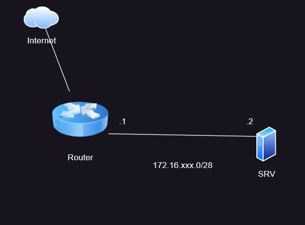

#Лабораторная работа №_
##Тема «Базовая настройка ecorouter»
###Цель: Настроить ecorouter как маршрутизатор для выхода в сеть интернет
####Схема сети:

####Задание:
1.	Задать имена устройствам
2.	Создать пользователя admin на обоих машинах, добавить в группу с максимальными правами.
3.	Настроить IP-адресацию
4.	Настроить на ecorouter трансляцию адресов
5.	Установить на srv приложение nano
 
Последовательность выполнения работы:
1.	Задать имена устройствам
2.	Для router это роль admin, для srv это группа wheel
3.	Для router
1.	Создать логический интерфейс
2.	Привязать физический port к логическому интерфейсу
4.	Для srv
1.	Отредактировать/создать файлы:
i.	options
ii.	ipv4address
iii.	ipv4route
iv.	resolv.conf
5.	Настроить пул адресов, которые будут транслироваться
6.	На логических интерфейсах указать input/output
7.	Связать пул адресов с внешним интерфейсом
8.	Обновить кеш репозиториев/установить приложение.
