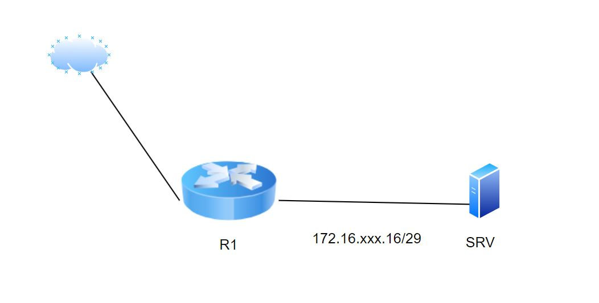

# Лабораторная работа №2
## Тема «Настройка DHCP-сервера»
### Цель: Настроить ecorouter в роли сервера DHCP
#### Схема сети:

### Задание:

1. Задать устройствам имена в соответствии со схемой.
2. Настроить IP-адресацию на R1, в сторону Интернет  
 __Дома можно выбрать любой свободный адрес вашей сети__

    |3са1                              | 3са2                               |
    |----------------------------------|------------------------------------|
    |IP-адрес выходного интерфейса:    | IP-адрес выходного интерфейса:     |
    |192.168.100.2xx|192.168.100.1xx |

    интерфейс с торону SRV имеет 1ый адрес подсети                         
    SRV получает IP-адрес по DHCP                                          
3. Настроить DHCP-сервер на устройстве R1 для подсети SRV

4. Установить на SRV приложение htop