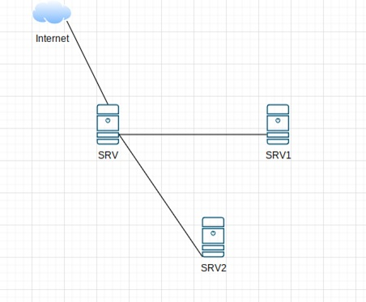

## Лабораторное занятие №10  
### Тема: «Установка, настройка ansible»  

#### **Задание:**  
#### **Схема сети::**  
     

1.	Настроить Адресацию на всех машинах:  
    •	Интерфейс SRV в сторону Internet получают адресацию по DHCP.  
    •	SRV — 192.168.xxx.1  
    •	SRV1 — 192.168.xxx.2  
    •	SRV2 — 192.168.xxx.3  
2.	SRV установить пакет ansible
3.	Создать inventory файл с описанием машин сети. Для машины с ip 192.168.xxx.2 использовать псевдоним SRV1, для машины с ip 192.168.xxx.3 использовать псевдоним SRV2.
4.	Запустить ping отдельно для каждой машины SRV1 и SRV2.

## **Методические указания:**  
**Ansible** — система управления конфигурацией программного обеспечения. В отличие от большинства других систем управления конфигурацией Ansible использует безагентную архитектуру. Агента нет, операции выполняются через SSHподключение.   

**Достоинства**   
• Написан на Python и активно использует Python (для некоторых может это и не достоинство).   
• Достаточно просто начать использование, не требует предварительной подготовки   
• Использует стандартный и общедоступный протокол SSH (SSH-клиент и SSHсервер) как основное средство коммуникации.   
• Использование YAML для описания конфигурационных файлов.   
• Не инсталлируется никакой дополнительный софт на управляемые машины, это хорошо в том числе с точки зрения безопасности, потому что не устанавливаются потенциально уязвимые программы.      

**Недостатки**  
• Требует SSH по умолчанию.   
• Толком не поддерживает Windows.   
• Довольно плохо масштабируется.   
• Код модулей исполняется при импорте, поэтому чтобы красиво протестировать код в модулях, требуется немного магии. Если вы не любите лишнюю магию, это может быть недостатком.   
• Не очень развитое комьюнити, велика роль одного человека.   
• Нет консистентности между форматами входных, выходных и конфигурационных файлов.   
• Для описания логики используется Jinja2, при росте сложности задачи нелинейно растёт сложность файлов.   

#### Конфигурационные файлы и их приоритет   
1. ANSIBLE_CONFIG
2. ansible.cfg
3. ~/.ansible.cfg
4. /etc/ansible/ansible.cfg

#### Сущности Ansible 
1. Module — атомарное действие, которое можно выполнить с помощью команды ansible
2. Task — вызов модуля с параметрами
3. Playbook — несколько тасков или ролей
4. Role — структурированные плейбуки, состоящие из тасков Повышение привилегий в Ansible

Для многих модулей Ansible необходимы права администратора на удаленной машине. Для этого в playbook может использоваться строка become: true (все модули автоматически исполняются с повышением привилегий).  

(!) Повышение привилегий на удаленной машине запрашивается отдельно от авторизации по протоколу SSH, поэтому даже если авторизоваться по заранее настроенному ключу, для большинства модулей повышение привилегий все равно будет необходимо. Опции для командной строки: --ask-become-pass, -K – будет запрашиваться пароль для повышения привилегий (на всех хостах). --become, -b – запуск модуля с повышением привилегий без пароля.  

Подробное описание управления привилениями через Ansible в официальной документации: **https://docs.ansible.com/ansible/latest/playbook_guide/playbooks_privilege_escalation.html**  

**Рекомендации по работе с Ansible**  
• Все конфигурационные файлы, плейбуки, роли нужно хранить в git 
• Проектировать и писать роли, которые можно переиспользовать в разных проектах 
• Все виртуальные машины описывать в отдельном inventory для каждого окружения 
• Каждая роль должна содержать README.md (инструкцию) по использованию 

#### Общий порядок работы с Ansible:  
1. Создать inventory-файл (список хостов), который будет содержать группы ipадресов, соответствующих тем или иным хостам, дать каждой группе уникальное имя, по которому можно к ней обращаться.
2. Создать playbook, который содержит указания, к каким группах хостов подключаться и с какими параметрами (необходимость повышения привилегий, пользователь, под которым нужно авторизоваться, роли, которые нужно запустить на выполнение).
3. Создать роли (roles), в которых будут описаны конкретные действия (модули), их описание и условия, при которых действия будут выполнены (например, на разных ОС установка ПО происходит с помощью различных пакетных менеджеров).
4. Запустить playbook (опционально – с указанием inventory-файла, если работа идет не с файлом по умолчанию), убедиться, что прописанные в playbook роли корректно выполняются.

(!) файл playbook может быть объединен с файлами ролей/сценариев (содержать помимо конфигурации модули и параметры их запуска), в некоторых примерах необходимо обращать на это внимание.   
(!) в файлах *.yml важны отступы формируют структуру документа и иерархию элементов. Например: 
`---`  
` - name: Update Package on debian system hosts:`  
   `all become: yes`  
   `tasks:`   
   `- name: Run the equivalent of "apt-get update" as a separate step `
   `apt:`   
   `update_cache: yes`   
   `- name: Install latest version of "openjdk-6-jdk"`   
   `apt: `  
  ` name: openjdk-6-jdk `  
  ` state: latest install_recommends: no`     

  
**Синтаксис YAML**: https://1cloud.ru/blog/yaml_for_beginners   
**Список основных модулей Ansible и примеры их использования**: https://habr.com/ru/companies/southbridge/articles/707130/   
**Структура Playbook**: https://habr.com/ru/companies/southbridge/articles/690614/   
**Примеры использования основных команд Ansible**: https://www.8host.com/blog/kak-rabotat-s-ansible-prostaya-i-udobnaya-shpargalka/   
**Создание пользовательских inventory-файлов**: https://www.8host.com/blog/sozdanie-fajla-inventarya-ansible/   
**Управление systemd с помощью Ansible (в примерах отступы yml-файлов отсутствуют, для корректной работы примеров отступы нужно добавить)**: https://andreyex.ru/debian/kak-upravlyat-systemd-s-pomoshhyu-ansible/   
**Пример установки и настройки nginx с помощью Ansible**: https://www.dmosk.ru/instruktions.php?object=ansible-nginx-install

