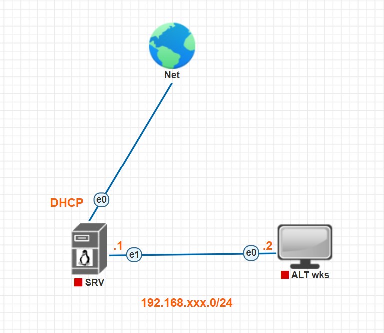

## Лабораторное занятие №2  
### Тема: «Настройка сети в ALT linux»   
#### Цель: Приобрести понимание принципов настройки сети. Настроить сеть по заданным параметрам.  
### Схема сети:  
  
### Методические указания:   
Сеть в ОС ALT linux может быть настроена 3 способами:  
1.	С помощью центра управления системой(ЦУС)  
2.	Настройка через файлы параметров Ethnet  
3.	Настройка с помощью утилиты NetworkManager  
##### Настройка сети с помощью ЦУС   
Конфигурирование сетевых интерфейсов осуществляется в модуле ЦУС **Ethernet-интерфейсы** (пакет alterator-net-eth) из раздела **Сеть**:   
   
В модуле **Ethernet-интерфейсы** можно заполнить следующие поля:  
* **Имя компьютера** — указать сетевое имя ПЭВМ в поле для ввода имени компьютера (это общий сетевой параметр, не привязанный к какомулибо конкретному интерфейсу). Имя компьютера, в отличие от традиционного имени хоста в Unix (hostname), не содержит названия сетевого домена;  
* **Интерфейсы** — выбрать доступный сетевой интерфейс, для которого будут выполняться настройки;  
* **Версия протокола IP** — указать в выпадающем списке версию используемого протокола IP (IPv4, IPv6) и убедиться, что пункт **Включить**, обеспечивающий поддержку работы протокола, отмечен;  
* **Конфигурация** — выбрать способ назначения IP-адресов (службы DHCP, Zeroconf, вручную);  
* **IP-адреса** — пул назначенных IP-адресов из поля **Добавить ↑ IP**, выбранные адреса можно удалить нажатием кнопки **Удалить**;  
* **Шлюз по умолчанию** — в поле для ввода необходимо ввести адрес шлюза, который будет использоваться сетью по умолчанию;  
* **DNS-серверы** — в поле для ввода необходимо ввести список предпочтительных DNS-серверов, которые будут получать информацию о доменах, выполнять маршрутизацию почты и управлять обслуживающими узлами для протоколов в домене;  
* **Домены поиска** — в поле для ввода необходимо ввести список предпочтительных доменов, по которым будет выполняться поиск. Если в поле **Домены поиска** перечислить наиболее часто используемые домены (например, domain), то можно пользоваться неполными именами машин (computer вместо computer.domain).  

**IP-адрес** и **Маска сети** — обязательные параметры каждого узла IP-сети. Первый параметр – уникальный идентификатор машины, от второго напрямую зависит, к каким машинам локальной сети данная машина будет иметь доступ. Если требуется выход во внешнюю сеть, то необходимо указать параметр **Шлюз по умолчанию**.  
В случае наличия DHCP-сервера можно все вышеперечисленные параметры получить автоматически — выбрав в списке **Конфигурация** пункт **Использовать DHCP**:  
   

### **Примечание**
При переключении конфигурации с **Использовать DHCP** на **Вручную** в поле **IP-адреса** может отображаться IP-адрес, полученный по DHCP. Этот адрес никак не используется в дальнейшей настройке. Необходимо удалить отображаемый IP-адрес и задать адрес вручную, иначе сетевому интерфейсу будет назначен IP-адрес локальной заглушки (например, 127.0.0.2).   

Дополнительно для каждого интерфейса можно настроить сетевую подсистему (NetworkManager, Etcnet, systemd-networkd), а также должен ли запускаться данный интерфейс при загрузке системы: 
  

### **Примечание**
Список доступных сетевых подистем зависит от пакетов, выбранных на этапе **Установка системы** (группа пакетов **Система управления сетевыми интерфейсами** ) 
В списке **Сетевая подсистема** можно выбрать следующие режимы:
## **Etcnet** 
В этом режиме настройки берутся исключительно из файлов находящихся в каталоге настраиваемого интерфейса **/etc/net/ifaces/<интерфейс>**. Настройки сети могут изменяться либо в ЦУС в данном модуле, либо напрямую через редактирование файлов **/etc/net/ifaces/<интерфейс>**.  
## **NetworkManager (etcnet)** 
В этом режиме **NetworkManager** сам инициирует сеть, используя в качестве параметров — настройки из файлов Etcnet. Настройки сети могут изменяться либо в ЦУС в данном модуле, либо напрямую через редактирование файлов **/etc/net/ifaces/<интерфейс>**. В этом режиме можно просмотреть настройки сети, например, полученный по DHCP IP-адрес, через графический интерфейс NetworkManager.  
## **NetworkManager (native)** 
В данном режиме управление настройками интерфейса передаётся **NetworkManager** и не зависит от файлов Etcnet. Управлять настройками можно через графический интерфейс **NetworkManager**. Файлы с настройками находятся в каталоге **/etc/NetworkManager/system-connections**. Этот режим особенно актуален для задач настройки сети на клиенте, когда IP-адрес необходимо получать динамически с помощью DHCP, а DNS-сервер указать явно. Через ЦУС так настроить невозможно, так как при включении DHCP отключаются настройки, которые можно задавать вручную. 
## **systemd-networkd** 
В данном режиме управление настройками интерфейса передаётся службе systemd-networkd. Настройки сети могут изменяться либо в ЦУС в данном модуле (только настройки физического интерфеса), либо напрямую через редактирование файлов **/etc/systemd/network/<имя_файла>.network, /etc/systemd/network/<имя_ файла>.netdev, /etc/systemd/network/<имя_файла>.link**. Данный режим доступен, если установлен пакет systemd-networkd; 

**Не контролируется** В этом режиме интерфейс находится в состоянии DOWN (выключен). 

Настройка параметров сети с использованием файлов конфигурации (Etcnet) Файлы настройки сети для интерфейса enp0s3:    
`\# ls -1 /etc/net/ifaces/enp0s3`      
`ipv4address`     
`ipv4route options`     
`resolv.conf`       

где:  
•	файл ipv4address — содержит IP-адрес с длиной маски;  
•	файл ipv4route — содержит маршрут по умолчанию;  
• 	файл options — содержит настройки конфигурации;  
• 	файл resolv.conf — содержит DNS-сервер.  

#### Пример содержимого файла /etc/net/ifaces/enp0s3/options:  
`BOOTPROTO=dhcp  `  
`TYPE=eth  `  
`NM_CONTROLLED=no  `  
`DISABLED=no  `  
`CONFIG_WIRELESS=no  `  
`SYSTEMD_BOOTPROTO=dhcp4 `   
`CONFIG_IPV4=yes  `  
`SYSTEMD_CONTROLLED=no `   
`ONBOOT=yes  `  
`CONFIG_IPV6=no  `  

Параметр BOOTPROTO отвечает за способ получения сетевой картой сетевого адреса и может принимать значения:  
•	static — адреса и маршруты будут взяты из файлов ipv4address и ipv4route;  
•	dhcp — интерфейс будет сконфигурирован по DHCP;  
•	ipv4ll — интерфейс будет сконфигурирован с помощью IPv4LL (link-local).  
Это значит, что из сети 169.254.0.0/16 (169.254.0.1-169.254.255.254) будет подобран ещё не использованный адрес и назначен на интерфейс.  

Для настройки статического IP-адреса для интерфейса enp0s3 необходимо изменить запись **BOOTPROTO=dhcp** на **BOOTPROTO=static** в файле **/etc/net/ifaces/enp0s3/option**.  

Затем нужно задать IP-адрес и маску сети, например 
192.168.0.48/255.255.255.0, для этого в файл **/etc/net/ifaces/enp0s3/ipv4address** запишем параметры соединения:  

`\# echo 192.168.0.48/24 > /etc/net/ifaces/enp0s3/ipv4address`

### **Примечание**
Если файл не существовал, он будет создан, иначе - его содержимое будет перезаписано.

Если сетевая карта предполагает наличие двух IP-адресов, то в 
файл **ipv4address** следует добавить ещё один адрес (обратите внимание на то, что используется ">>" вместо ">"; с ">" файл перезапишется, с ">>" вывод предыдущей команды будет дописан в конец файла):  

`\# echo 192.168.0.148/24 >> /etc/net/ifaces/enp0s3/ipv4address  `

Далее запишем в файл /etc/net/ifaces/enp0s3/ipv4route имя шлюза по умолчанию (например, 192.168.0.1):  

`\# echo default via 192.168.0.1 > /etc/net/ifaces/enp0s3/ipv4route   `

Если необходимо, можно создать файл с описанием dnsсервера **/etc/net/ifaces/enp0s3/resolv.conf**:  

`\# echo nameserver 192.168.0.9 > /etc/net/ifaces/enp0s3/resolv.conf   `

Если у вас два dns (второй, например, 192.168.1.9), то его описание также нужно добавить в этот файл:  

`\# echo nameserver 192.168.1.9 >> /etc/net/ifaces/enp0s3/resolv.conf  `

**Для применения настроек необходимо перезапустить сеть:**  
`\# systemctl restart network  `

IP-адрес, маску и шлюз можно изменить командами ip addr 
{add|change|replace|del } ... и ip route {add|del|change|append|replace} .... Например:  
`\# addr add 192.168.0.140/24 dev enp0s3  `  
`\# route add dev enp0s3 192.168.0.240  `

Однако эти команды изменяют конфигурацию сети до ближайшей перезагрузки компьютера. Для постоянного изменения нужно отредактировать файлы, о которых говорилось выше. 

## **Настройка сети с помощью утилиты NetworkManager**  
**nmcli** — это инструмент командной строки для управления NetworkManager и  создания отчетов о состоянии сети. 	**nmcli** можно использовать для создания, 
отображения, редактирования, удаления, активации и деактивации сетевых  подключений, а также для управления состоянием сетевых устройств. Синтаксис команды **nmcli**:   
`$ nmcli <опции> <объект> <команда> ` 

### **Объекты над которыми могут выполняется операции с помощью команды nmcli:** 

•	**general** — возвращает состояние и разрешения NetworkManager, позволяет получить/изменить имя хоста, а также уровень ведения журнала NetworkManager; 
•	**networking** — возвращает состояние сетевых подключений, позволяет включить/отключить сеть;  
•	**radio** — возвращает состояние подключения к сети Wi-Fi, позволяет включить/отключить сеть Wi-Fi;  
•	**connection** — позволяет управлять сетевыми интерфейсами, позволяет добавить/удалить соединение;  
•	**device** — возвращает состояние, позволяет управлять настройками сетевых устройств;  
•	**monitor** — мониторинг активности NetworkManager, позволяет отслеживать изменения состояний сетевых подключений. Состояние NetworkManager:  

`$ nmcli general status`    
`STATE       CONNECTIVITY  WIFI-HW   WIFI      WWAN-HW  WWAN `   
`подключено  полностью     включено  включено  missing  включено `  

**Состояние сетевых интерфейсов:**

   ` $ nmcli device status    `  
   ` DEVICE             TYPE      STATE           CONNECTION `   
    `enp0s31f6          ethernet  подключено      System enp0s31f6  `  
    `wlp0s20f3          wifi      подключено      Space2         p2p-dev-wlp0s20f3  `  
    `wifi-p2p  отключено       --                lo                 loopback    `  
    `без управления  --   `    

**Проверка состояния подключения к сети:**  
    `$ nmcli networking connectivity check `  
`full`   

**Список доступных подключений:**  
    `$ nmcli connection show  `
    `NAME              UUID                                 TYPE      DEVICE     `   
    `System enp0s31f6  0f179fcd-4c89-e0f9-6475-062aa5905ceb  ethernet  enp0s31f6  `   
    `Space2            21f113eb-f40c-468f-9727-0f0baec6489e  wifi      wlp0s20f3 `    
   ` QHotspot          29b1afe5-4812-4457-8ab1-5bfc3f2a536c  wifi      --         `   
    `Space3            78806f0d-c3da-4c18-9d73-1ea5e8c94ea7  wifi      --       `     
   ` Space5            c8943b43-13e1-4f42-89e6-bdad984ebd0b  wifi      --     `  

Информация о подключении **System enp0s31f6**:   
    `$ nmcli connection show "System enp0s31f6"  ` 

Деактивировать подключение **System enp0s31f6**:   
   ` $ nmcli conn down "System enp0s31f6"   `

Изменить подключение **System enp0s31f6** с DHCP на Static:  
  

`    $ nmcli con mod "System enp0s31f6" ipv4.method manual ipv4.address 192.168.0.40/24 ipv4.gateway 192.168.0.1 `

Указать DNS-сервер:   
   ` $ nmcli connection modify "System enp0s31f6" ipv4.dns 192.168.0.122  `

Добавить DNS-сервер к имеющимся:   
   ` $ nmcli connection modify "System enp0s31f6" +ipv4.dns 8.8.8.8  ` 

Изменить подключение System enp0s31f6 на DHCP:   
    `$ nmcli con mod "System enp0s31f6" ipv4.method auto  `

Вывести список доступных сетей Wi-Fi:   
    `$ nmcli device wifi list `  

Подключиться к сети Wi-Fi:   
    `$ nmcli dev wifi con Space5 password io67%gfds name Space5 private yes `  

Создать точку доступа Wi-Fi:  
    $ nmcli -s dev wifi hotspot con-name QHotspot  
    Пароль точки доступа: bcL9ZEVx 
    Устройство «wlp0s20f3» успешно активировано с «d22e6d34-6357-4c96-9b3c2d63099c8681». 
    Подсказка: "nmcli dev wifi show-password" покажет имя и пароль Wi-Fi.  

Данная команда создаст профиль подключения к точке доступа и активирует его на устройстве. Точка доступа защищена WPA, если устройство/драйвер поддерживает WPA, в противном случае используется WEP. Если для точки доступа не задан пароль (опция --password), nmcli сгенерирует пароль. Удалить подключение:   
`$ nmcli con del QHotspot   `

## **Задание:**
1.	Задать параметры сетевым адаптерам в соответствии со схемой сети, где xxx – номер студента по журналу.  
    
2.	Настроить обе машины с помощью ЦУС, сделать скриншот ЦУС во время настройки и скриншот итоговых параметров.   
3.	Настроить обе машины с помощью Etcnet, сделать скриншот содержимого файлов конфигурации (вывести на экран с помощью утилиты cat), сделать скриншот вывода команды ip a.   
4.	Настроить обе машины с помощью NetworkManager. Сделать скриншот команды настройки и команды ip a.   
