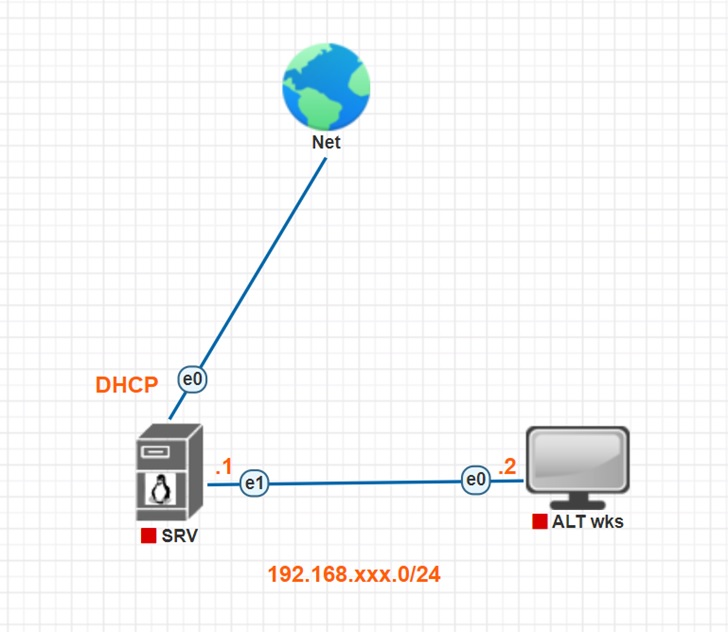
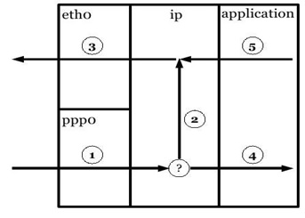

## Лабораторное занятие №3  
### Тема: «Настройка firewall в ALT linux»   
#### Цель: Повторить настройку сети. Приобрести понимание принципов настройки firewall. Настроить firewall по заданным параметрам.  

### **Методические указания:**  
#### **Схема сети:**  
   

### **Фильтрация пакетов (firewall) в Linux**  
В ядро Linux встроена возможность фильтрации сетевых пакетов. В ядрах версии 2.4.х и 2.6.х это программное обеспечение называется netfilter. 

Для управления фильтрацией пакетов необходимо использовать специальное программное обеспечение, позволяющее администратору настраивать параметры фильтрации. В зависимости от версии ядра, для управления используются различные программы: 

2.0.х — ipfwadm   
2.2.x — ipchains   
2.4.x и 2.6.x — iptables   

Несмотря на наличие трех разных программ управления фильтрацией пакетов, в современных версиях ядра Вы можете использовать любую из них, так как в Linux все они до сих пор поддерживаются. Но настоятельно рекомендуется пользоваться программой iptables, позволяющей использовать все возможности фильтрации пакетов современных ядер Linux.   
В этом блоке будет рассмотрена организации фильтрации пакетов и создание NAT преобразований при помощи программы iptables.  

### **Цепочки**  
С появление программы ipchains было введено понятие цепочки. Цепочка — это некоторый логический участок пути прохождения пакета, на который можно подключать правила фильтрации.  
Для облегчения понимания организации правил фильтрации предположим, что все пакеты поступают через интерфейс ppp0 (1), а уходят через интерфейс eth0 (3). После поступления пакета на уровне IP принимается решение о его маршрутизации. После решения о маршрутизации пакет передаётся либо приложениям, работающим на этом компьютере (4), либо уходит через другой сетевой интерфейс (2,3). Так же пакеты могут отправляться приложениями, работающими на компьютере (5,3).   
    

Стрелки, изображённые на рисунке, являются цепочками, на которые можно подключать правила фильтрации.   

|Название|Номер |
|---|------|
|REROUTING|1|
|POSTROUTING|3|
|INPUT |4|
|FORWARD|2|
|OUTPUT|5|

Имена цепочек зарезервированы и пишутся с большой буквы.   

В ipchains существует проблема с именами цепочек и прохождения пакетов через них. Если предположить, что пакет проходит транзитом через нашу машину, он будет последовательно проходить через цепочки INPUT (1), FORWARD (2) и OUTPUT (3). При этом в каждой цепочке пакет будет проверяться правилами, находящимися в каждой цепочке, что замедляет скорость прохождения пакета.   

Iptables избавлена от этого недостатка, так как транзитные пакеты проходят только через правила цепочки FORWARD (2). Пакеты, предназначенные для приложений на компьютере, проходят только через правила цепочки INPUT (4). Исходящие пакеты приложений компьютера обрабатываются правилами фильтрации цепочки OUTPUT (5).   

В ipchains и iptables пользователи могут определять свои собственные цепочки.  

**Таблицы**  
—  filter   
—  nat   
—  mangle   
Каждая таблица имеет индивидуальный набор цепочек. Пример, рассмотренный в предыдущей главе, описывал цепочки таблицы filter.   

**Таблица filter**  
Таблица предназначена для определения правил фильтрации пакетов.   

В таблице имеются три цепочки:  
—  INPUT (4)   
—  FORWARD (2)  
—  OUTPUT (5)  

**Таблица mangle**  
Таблица предназначена для внесения изменений в заголовки пакетов.  

В таблице имеется пять цепочек:  
—  PREROUTING (1)  
—  POSTROUTING (3)  
—  INPUT (4)  
—  FORWARD (2)  
—  OUTPUT (5)   

## **Программа iptables**  
`iptables [опции] [-t таблица] [-Команда][цепочка][критерии отбора] [-j действие]`   

Программа iptables предназначена для управления правилами **netfilter**. Она позволяет:   
•	добавлять, заменять, удалять правила   
•	создавать, удалять цепочки пользователя   
•	просматривать, устанавливать и сбрасывать счётчики пакетов   
Для определения, с какой таблицей будет работать программа, используется опция “-t”, после которой указывается соответствующая таблица: filter, nat, mangle. Если опция не указана, программа будет работать с таблицей filter.   

**Команды программы iptables**  
-A — добавить правило  
-D — удалить правило  
-R — заменить правило  
-I — вставить правило  
-L — показать список правил  
-F — очистить цепочку или таблицу  
-Z — обнулить счётчики  
-N — создать цепочку пользователя  
-X — удалить цепочку пользователя  
-P — установить политику по умолчанию  

Для определения действия, которое программа iptables должна выполнить, ей необходимо указать команду.  
|Команда|Описание|
|---|------|
|-A, -append |Добавляет правило в конец цепочки. При выполнении команды необходимо обязательно указать цепочку. Пример:  iptables -A INPUT -s 10.10.100.100 -j ACCEPT |
|-D, --delete|Удаляет правило из цепочки. Существуют два способа удаления правила: по|
|-L, --list |Если не указывать имя цепочки, команда показывает все правила текущей таблицы. Если указать имя цепочки — показывает все правила в указанной цепочке. Пример:  iptables -L INPUT|  

**Критерии отбора пакетов**  
При добавлении правила необходимо указывать критерии отбора пакетов, на которых это правило будет работать. Правила можно условно разделить на три группы:   
•	Общие критерии — не зависят от типа протокола и не требуют загрузки специальных модулей   
•	Неявные критерии — зависят от типа протокола и не требуют загрузки специальных модулей • Явные критерии — перед использованием требуют явной загрузки специальных модулей   

В одном правиле можно указывать сразу несколько критериев отбора пакетов. Если в правиле отбора пакета критерий не определён, значит возможно любое значение критерия. 

**Общие критерии**  
-p — определяет протокол  
-s — определяет IP источника  
-d — определяет IP назначения  
-i — определяет входной интерфейс  
-o — определяет выходной интерфейс  
-f — определяет фрагменты фрагментированного пакета  

Общие критерии не зависят от типа протокола и для их использования не требуется загрузка специальных модулей при помощи опции -m.  

|Критерий|Описание|
|---|------|
|-p |Критерий служит для определения типа протокола. В качестве дополнительного парамет- ра необходимо указывать имя,  номер протокола (см. файл /etc/protocols) или ключевое слово ALL. При указании протокола можно использовать символ “!”, который инвертирует значение критерия. Примеры:  `-p tcp` `-p ! icmp` | 
|-s |Критерий определяет IP адрес источника. В качестве дополнительного параметра можно указывать IP адрес машины или сети. В по- следнем случае необходимо указывать маску подсети. Символ “!” инвертирует значение параметра. Примеры: `-s 192.168.0.1 `  `-s 10.10.100.0/24`  `-s ! 10.10.100.0/255.255.255.0` |
|-d |Критерий определяет IP адрес получателя. В качестве дополнительного параметра можно указывать IP адрес машины или сети. В по- следнем случае необходимо указывать маску подсети. Символ “!” инвертирует значение параметра. Примеры: `-d 192.168.0.1` `-d 10.10.100.0/24` `-d ! 10.10.100.0/255.255.255.0` |
|-i |Критерий определяет интерфейс, с которого был получен пакет.   Использование этого критерия допускается только в цепочках INPUT, FORWARD и PREROUTING, в любых других случаях будет вызывать сообщение об ошибке. Если имя интерфейса завершается символом +, то критерий задает все интерфейсы, начинающиеся с заданной строки. Символ “!” инвертирует значение параметра. Примеры: `-i ! eth0` `-i ppp+` `-i ! eth1 ` |
|-o |Критерий определяет выходной интерфейс. Этот критерий допускается использовать только в цепочках OUTPUT, FORWARD и POSTROUTING, в противном случае будет генерироваться сообщение об ошибке. Если имя интерфейса завершается символом +, то критерий задает все интерфейсы, начинающиеся с заданной строки. Символ “!” инвертирует значение параметра. Примеры: `-o eth0` `-o ppp+` `-o ! eth1` |
|-f |Критерий определяет все фрагменты фрагментированного пакета, кроме первого. Символ “!” инвертирует значение параметра. Примеры: `-f !` |

**Неявные критерии**  
TCP критерии:   
--sport — порт источника   
--dport — порт назначения   
--tcp-flags — определение TCP флагов --syn — запрос на соединение UDP критерии:   
--sport — порт источника --dport — порт назначения ICPM критерии:   
--icmp-type — определяет тип ICMP-пакета   
Для того, чтобы воспользоваться явными критериями, необходимо при помощи критерия “p” указать протокол и только после этого определять явные критерии.   

**TCP критерии**  
TCP критерии можно использовать только после определения протокола TCP: -p tcp. 
|Критерий|Описание|
|---|------|
|--sport |Критерий определяет порт, с которого был отправлен пакет. В качестве дополнительного па- раметра можно указывать номер порта или имя службы (см. файл /etc/services). Так же можно указывать диапазон портов, разделенных символом “:”. Символ “!” инвертирует значение параметра. Примеры: `--sport 1024:65535 ` `--sport 80 ` `--sport ! www `  |  
|--dport |Критерий определяет порт назначения. В каче- стве дополнительного параметра можно указывать номер порта или имя службы (см. файл /etc/services). Так же можно указывать диапазон портов, разделенных символом “:”. Символ “!” инвертирует значение параметра. Примеры: `--dport 1024:65535  ` `--dport 80  ` `--dport ! www `  |  
|--tcp-flags |Критерий позволяет контролировать флаги TCP пакета. В качестве дополнительных пара- метров указывают список интересующих флагов и через пробел список флагов, значения которых должны быть равны 1. Так же можно использовать ключевые слова ALL — все, NONE — ни одного.  Символ “!” инвертирует значение параметра. Пример: `--tcp-flags SYN,ACK,FIN SYN ` |  

**UDP критерии**
UDP критерии можно использовать только после определения протокола UDP: p udp.  
|Критерий|Описание|
|---|------|
|--sport |Критерий определяет порт, с которого был отправлен пакет. В качестве дополнительного параметра можно указывать номер порта или имя службы (см. файл /etc/services). Так же можно указывать диапазон портов, разделен- ных символом “:”. Символ “!” инвертирует значение параметра. Примеры: `--sport 1024:65535  ` `--sport 21 `  |
|--dport |Критерий определяет порт назначения. В качестве 
дополнительного параметра можно указывать номер порта или имя службы (см. файл /etc/services). Так же можно указывать диапазон портов, разделенных символом “:”.  Символ “!” инвертирует значение параметра. Примеры: `--dport 1024:65535 ` `--dport 21 `  |  

**Действия и переходы**  
ACCEPT — принять пакет   
DROP — сбрасывает пакет   
REJECT — сбрасывает пакет с сообщением об ошибке RETURN — возврат из цепочки.   
LOG — помещает информацию в журнальные файлы   

Действия и переходы сообщают правилу, что необходимо выполнить, если пакет соответствует заданному критерию.   

Переходы позволяют перейти в цепочку пользователя. В этом случае достаточно после параметра “-j” указать имя цепочки.   

Действие – это предопределенная команда, описывающая действие, которое необходимо выполнить, если пакет совпал с заданным критерием. Например, можно применить действие DROP или ACCEPT. Существуют и другие типы действий, некоторые из них будут рассмотрены ниже.   

**Действие ACCEPT**
Если над пакетом выполняется действие ACCEPT, то пакет прекращает движение по цепочке (и всем вызвавшим цепочкам, если текущая цепочка была вложенной) и считается ПРИНЯТЫМ.  

**Действие DROP**   
Действие просто “сбрасывает” пакет и netfilter “забывает” о его существовании. “Сброшенные” пакеты прекращают свое движение полностью, т.е. они не передаются в другие таблицы, как это происходит в случае с действием ACCEPT. Следует помнить, что данное действие может иметь негативные последствия, поскольку может оставлять незакрытые “мертвые” сокеты как на стороне сервера, так и на стороне клиента. Наилучшим способом защиты будет использование действия REJECT, особенно при защите от сканирования портов.   

**Действие REJECT**  
REJECT используется, как правило, в тех же самых ситуациях, что и DROP, но в отличие от DROP, команда REJECT выдает сообщение об ошибке на хост, передавший пакет. Действие REJECT может использоваться только в цепочках INPUT, FORWARD и OUTPUT (и во вложенных в них цепочках).   

**NAT преобразования**  
NAT преобразования позволяют заменить в заголовках пакетов IP адрес источника или назначения, а также порт источника или назначения.   

В netfilter существуют два основных действия, позволяющие осуществить NAT преобразования:   
•	SNAT — замена адреса и/или порта источника   
•	DNAT — замена адреса и/или порта назначения   

Кроме того, у SNAT и DNAT существуют частные случаи:   
•	MASQUERADE — частный случай SNAT  
• REDIRECT — частный случай DNAT  

### **SNAT** 
Предположим, что существует сеть 10.10.100.0/24 и необходимо сделать так, чтобы компьютеры, находящиеся в этой сети, могли получить доступ в Internet. 

Недостаточно просто разрешить хождение пакетов через роутер. Все пакеты, отправляемые с машин клиентов, в поле IP источника будут содержать IP адрес внутренней сети. Первый же роутер Вашего провайдера такие пакеты будет отбрасывать. Даже если предположить, что такой пакет дойдёт, например, до WEB сервера, сервер не будет знать, как ответить клиенту.  
Ведь на роутерах в Internet не прописаны маршруты к частным сетям.   

Наша задача при выходе пакета из нашего роутера заменить IP адрес частной сети на реальный IP внешнего интерфейса роутера, и обеспечить механизм обратного преобразования, когда пакеты будут возвращаться на роутер из Internet для передачи их машинам во внутренней сети.   

Если выходной интерфейс имеет статический IP адрес, можно применять действие SNAT, которое позволяет осуществлять замены IP адреса и/или порта источника. Предположим, что роутер подключён к Internet через интерфейс eth0 с IP адресом 1.2.3.4, а все пакеты посылаются из внутренней сети с машины с адресом 10.10.100.1. Тогда для замены IP адреса источника воспользуемся следующей командой:  

`iptables -t nat -A POSTROUTING -p tcp -o eth0-j SNAT --to-source 1.2.3.4 `  
Все действия с NAT преобразованиями следует производить только в таблице nat (-t nat). SNAT преобразования можно делать только в цепочке цепочке POSTROUTING (-A POSTROUTING). При использовании действия SNAT обязательно следует указывать протокол (-p tcp). Действия по замене будем производить только над теми пакетами, которые должны выходить в Internet, т.е. пакеты, выходящие через интерфейс eth0 (-o eth0). IP адрес источника будем менять на IP адрес внешнего интерфейса — 1.2.3.4 (--to-source 1.2.3.4).   

Для иллюстрации того, что будет происходить с пакетами можно представить следующую таблицу:  
|До SNAT||
|-----|-----|
|IPs |Ports|
|10.10.100.1 |4000 |

|После SNAT||
|----|------|
|IPs |Ports|
|1.2.3.4 |4000|  

Теперь предположим, что с другой машины в сети открывается ещё одно соединение с сервером в Internet и тоже с порта 4000. Получается неприятная ситуация. Все пакеты, которые будут выходить с роутера в Internet, будут видны как пакеты соединения открываемого роутером с определённого порта. И получается, что два соединения открываются с одного и того же порта. Такого быть не должно. Поэтому при SNAT необходимо менять не только IP адрес источника, но и порт. Например, следующим образом:   
`iptables -t nat -A POSTROUTING -p tcp -o eth0 -j SNAT --to-source  1.2.3.4:30000-35000 `  
Теперь при открытии соединения будет меняться и порт ис- точника. Причём будет выбираться следующий свободный порт из указанного диапазона: 

|До SNAT||
|-----|-----|
|IPs |Ports|
|10.10.100.1 |4000 |
|10.10.100.2  |4000 |

|После SNAT||
|----|------|
|IPs |Ports|
|1.2.3.4 |30000|
|1.2.3.4 |30001|    

Поскольку netfilter отслеживает соединения, во всех пакетах приходящих обратно, IP адрес назначения автоматически меняется на IP адрес внутренней сети, и пакет попадает по назначению.   

### **MASQUERADE**  
Действие MASQUERADE является частным случаем SNAT преобразования. Его рекомендуют применять в тех случаях, когда IP адрес получается динамически: при PPP соединении или от DHCP сервера.  

Маскарадинг подразумевает получение IP адреса от заданного сетевого интерфейса вместо прямого его указания, как это делается с помощью ключа --tosource в действии SNAT. Действие MASQUERADE имеет хорошее свойство – “забывать” соединения при остановке сетевого интерфейса. В случае же SNAT, в этой ситуации, в таблице трассировщика остаются данные о потерянных соединениях, и эти данные могут сохраняться до суток, поглощая ценную память. Эффект “забывчивости” связан с тем, что при остановке сетевого интерфейса с динамическим IP адресом есть вероятность на следующем запуске получить другой IP адрес, но в этом случае любые соединения все равно будут потеряны, и было бы глупо хранить трассировочную информацию.   

Невзирая на положительные черты, маскарадинг не следует считать предпочтительным, поскольку он дает большую нагрузку на систему.  Для примера, описанного в предыдущей главе, вместо SNAT можно использовать следующую команду:   
`iptables -t nat -A POSTROUTING -o eth0 -j MASQUERADE `  
Обратите внимание на то, что в этом случае нет необходимости указывать протокол. 
Дополнительно можно использовать необязательный ключ --to-ports — порт или диапазон портов. 

### **DNAT**  
Предположим, что в DMZ (10.10.100.0/24) находится WEB-сервер (10.10.100.1) и необходимо организовать доступ к этому серверу из Internet. Внешний интерфейс роутера (eth0) имеет IP адрес 1.2.3.4. В DNS, машине www соответствует IP 1.2.3.4, т.е. все пакеты предназначенные нашему WEB серверу, будут приходить на этот IP на порт 80. Нам необходимо организовать пересылку этих пакетов на машину 10.10.100.1 на порт 80.   
Для решения этой задачи можно воспользоваться действием DNAT, при помощи которого у проходящих пакетов меняются IP адрес и/или порт назначения.   
`iptables -t nat -A PREROUTING -p tcp --dport 80 -j DNAT --to-destination 10.10.100.1 `  

Обязательный ключ --to-destination — определяет IP адрес и/или порт, на которые будут заменены соответствующие поля.  
Теперь у всех пакетов TCP, направленных на порт 80, IP ад- реса назначения будут меняться на IP 10.10.100.1. Поскольку дей- ствие DNAT можно определять только на цепочке PREROUTING (до принятия решения о маршрутизации), после замены IP адреса, пакет будет перенаправлен по необходимому маршруту согласно стандарт- ной таблицы маршрутизации. Так как netfilter отслеживает соедине- ния, в памяти организуется таблица, похожая на таблицу, которую мы рассматривали в случае SNAT. У пакетов идущих обратно, IP адрес источника меняется автоматически.   

При помощи DNAT можно организовать равномерное распределение соединений между несколькими серверами, обслуживающими одну и ту же службу. Например, в DMZ существуют три WEB сервера (10.10.100.1 — 10.10.100.3) и необходимо распределить между ними соединения.   
`iptables -t nat -A PREROUTING -p tcp --dport 80 -j DNAT --to-destination 10.10.100.1 10.10.100.3 `  
Теперь новое соединение будет перенаправлено на сервер, у которого в данный момент времени наименьшее количество открытых соединений. Правда у этого метода есть один существенный недостаток — если один из серверов перестанет работать, netfilter это не “увидит” и будет пытаться новые соединения перенаправлять на неработающий сервер.   

# **Задание:**  
1.	Нужно настроить адресацию пк в соответствии со схемой. 
2.	Необходимо настроить сервер в качестве шлюза. 
    a.	На машинах под управлением Linux по умолчанию запрещен обмен пакетов между интерфейсами, что бы это исправить необходимо в файле 
    **/etc/net/sysctl.conf** поменять значение строки `net.ipv4.ip_forward` c **0** на **1**. 
    b.	Необходимо настроить **PAT (MASQUERADE)** на выходной интерфейс. 
3.	С клиента в браузере открыть сайт с ip-адресом сервера http://192.168.xxx.1/, убедится в доступности сайта. 
4.	На сервере прописать правило через **iptables** которое будет блокировать/отбрасывать все пакеты, входящие на порт 80. 
5.	После выполнения всех настроек проверить с клиента доступность сети интернет(ping 8.8.8.8) и доступность сайта по адресу сервера 
(http://192.168.xxx.1/), если первый параметр доступен, а второй нет – работа выполнена верно и необходимо: 
6.	Добавить iptables в автозагрузку `systemctl enable iptables`
7.	Сохранить правила командой `iptables-save –f /etc/sysconfig/iptables` 
8. Перезагрузить сервер `reboot`, проверить сохранились ли правила п.5 

### **Пример использования iptables:**  
Что бы заблокировать все исходящие пакеты ssh от сервера в интернет – нужно заблокировать порт 22 на интерфейсе, который направлен в сторону интернета. Для этого используется следующая команда:   
`iptables –A OUTPUT –o ens3 –j DROP` где:  

–A OUTPUT – добавляет в конец правило для цепочки OUTPUT(исходящие пакеты)   
–o ens3 – указывает ИСХОДЯЩИЙ интерфейс в нашем случае ens3   
–j DROP – указывает необходимое действие, в нашем случае отбросить.   