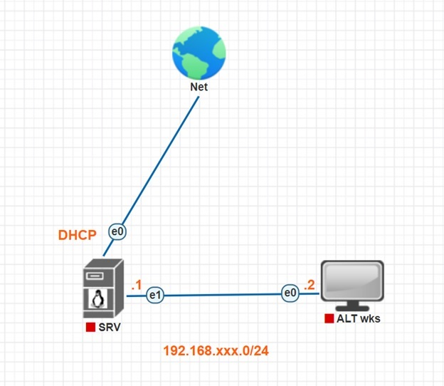

## Лабораторное занятие №6  
### Тема: «Настройка домена»  

#### **Задание:**  
    

1.	Настроить сеть в соответствии с топологией.
2.	На машине SRV создать домен samba-dc с именем test.loc
3.	Настроить DNS со следующими параметрами параметрами 

|Устройство|Запись|Тип|
|--|--|--|
|SRV|srv.test.loc|A,PTR|
|SRV|dns.test.loc|CNAME|
|ALTwks|wks.test.loc|A,PTR|

4.	Создайте 5 пользователей: имена пользователей формата user№.test.loc Создайте группу test, введите в эту группу созданных пользователей
5.	Введите машину ALTwks в домен.
