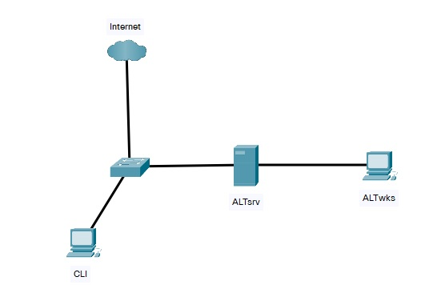

## Лабораторное занятие №8  
### Тема: «Настройка ssh»  

#### **Задание:**  
**ВНИМАНИЕ!!! Перед запуском виртуальных машин, зайти в настройки -> сеть -> ок**  

#### **Схема сети::**  
     
1.	Настроить Адресацию на всех машинах:  
    •	На ALTsrv настроить DHCP в сторону ALTwks. Адрес подсети использовать любой (серые адреса), кроме подсети 192.168.100.0/24  
    •	Интерфейсы в сторону Internet получают адресацию по DHCP.  
2.	На ALTsrv настроить SSH сервер по следующим параметрам:  
    •	Изменить порт на 3322  
    •	Разрешить вход под учетной записью root.  
3.	На ALTwks запретить вход по SSH с паролем.
4.	На CLI настроить SSH таким образом, чтобы для подключения к остальным машинам не запрашивало пароль.
5.	На CLI настроить возможность входа без использования IP адреса машины (сделать имя входа srv для ALTsrv и wks для ALTwks)
6.	Организовать прямой доступ по SSH до машины ALTwks
