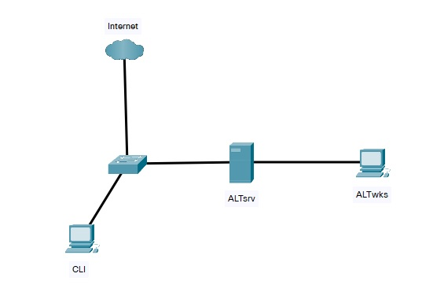

## Лабораторное занятие №9  
### Тема: «Установка, настройка и запуск docker и docker-compose»  

#### **Задание:**  
#### **Схема сети::**  
     

1.	Настроить Адресацию на всех машинах:  
    •	На ALTsrv настроить DHCP в сторону ALTwks. Адрес подсети использовать любой (серые адреса), кроме подсети 192.168.100.0/24  
    •	Интерфейсы в сторону Internet получают адресацию по DHCP.  
2.	На ALTsrv установить пакеты docker-engine и docker-compose.
3.	Добавить docker в автозагрузку
4.	Создать docker-compose файл для запуска приложения mediawiki
https://hub.docker.com/_/mediawiki
